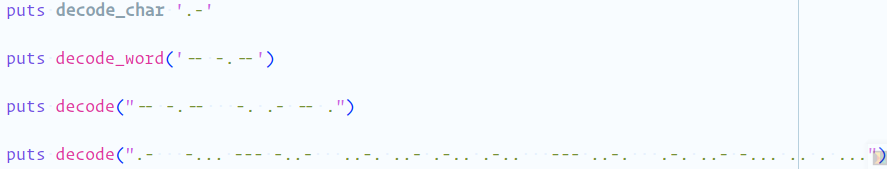
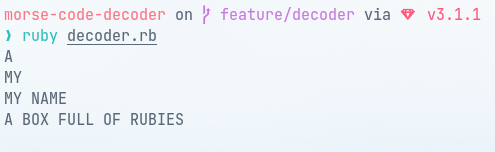

# Decode a Morse code message

> Ruby program to decode a Morse code message.

## Getting Started

Make sure you have Ruby installed by typing `ruby -v` in your terminal.

If you don't have ruby installed, you can install it with one of the following methods:

- In MacOS: `brew install ruby`,
- In Linux: `sudo apt-get install ruby`,
- In Windows: `https://www.rubyinstaller.org/downloads/`
In Windows: `ruby -v`

## Authors

👤 **Leonardo Albornoz**

| &nbsp;       | &nbsp;                                               |
| ------------ | ---------------------------------------------------- |
| **GitHub**   | [@Leboroz](https://github.com/Leboroz)           |
| **Twitter**  | [@Leboroz](https://twitter.com/leboroz)          |
| **LinkedIn** | [@Leboroz](https://www.linkedin.com/in/leboroz/) |

👤 **Andres Condezo**

| &nbsp;       | &nbsp;                                               |
| ------------ | ---------------------------------------------------- |
| **GitHub**   | [@Andres Condezo](https://github.com/andres-condezo)
| **LinkedIn** | [andres-condezo](https://www.linkedin.com/in/andres-condezo/) |

👤 **Fabrizio Garcia**

| &nbsp;       | &nbsp;                                               |
| ------------ | ---------------------------------------------------- |
| **GitHub**   | [@fabgrel10](https://github.com/fabgrel10)           |
| **Twitter**  | [@fabgrel10](https://twitter.com/fabgrel10)          |
| **LinkedIn** | [@fabgrel10](https://www.linkedin.com/in/fabgrel10/) |

## 🤝 Contributing

Contributions, issues, and feature requests are welcome!

Feel free to check the [issues page](../../issues/).

## Show your support

Give a ⭐️ if you like this project!

## Acknowledgments

- [Postgresql docs](https://www.postgresql.org/docs/)

## 📝 License

This project is [MIT](./MIT.md) licensed.
